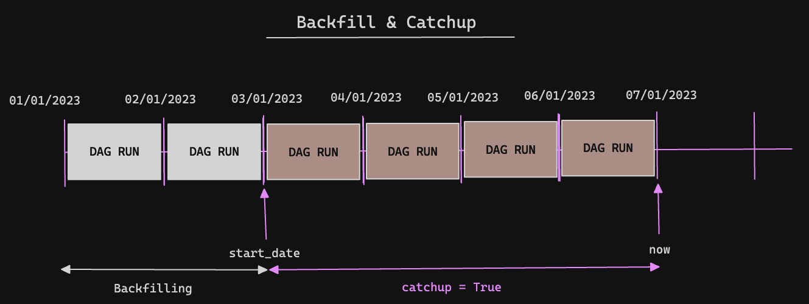
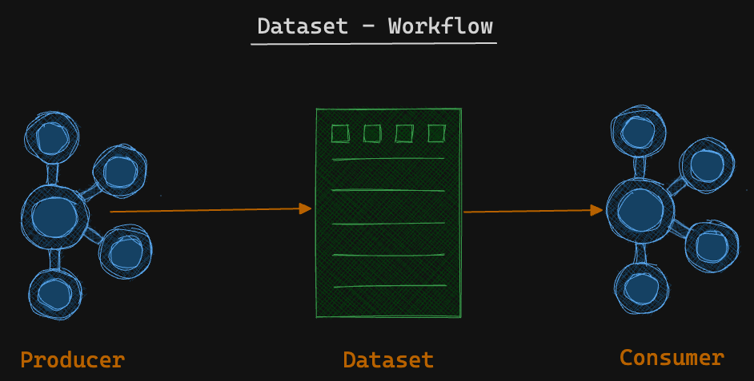
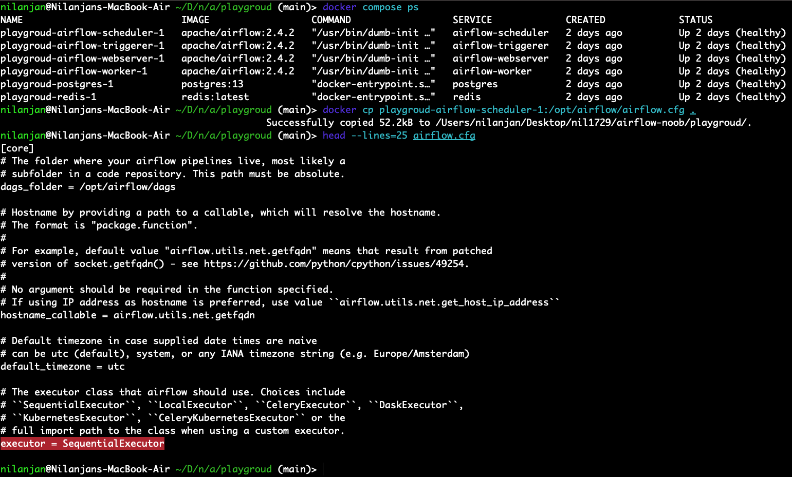
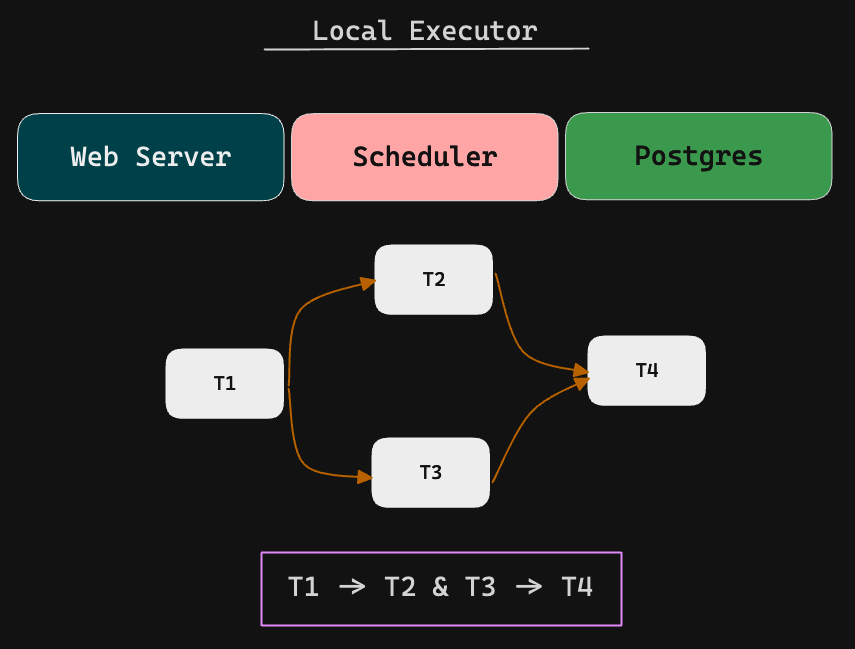
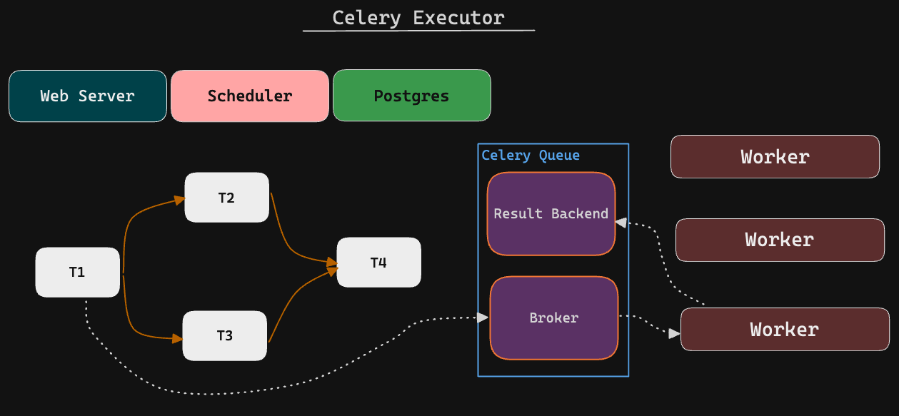
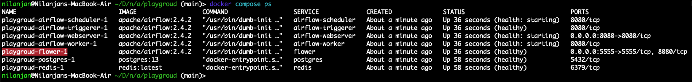

## What is Airflow ?
Airflow is an open-source platform designed for **programmatically authoring**, **scheduling**, and **monitoring** workflows. It provides a flexible framework for defining complex data pipelines as **Directed Acyclic Graphs (DAGs)** and executing tasks within those pipelines. Airflow enables the orchestration of tasks, tracks their dependencies, handles retries and failures, and offers a web-based user interface for monitoring and managing workflows. It is widely used in the data engineering and data science communities for building and managing scalable, reliable, and maintainable **data pipelines**.

## Airflow Components


- Airflow is an orchestrator, not a processing framework. Process your gigabytes of data outside of Airflow (i.e. You have a Spark cluster, you use an operator to execute a Spark job, and the data is processed in Spark).
- A **DAG** is a data pipeline, an **Operator** is a task.
- An **Executor** defines how your tasks are executed, whereas a **worker** is a process executing your task
- The **Scheduler** schedules your tasks, the **web server** serves the UI, and the **database** stores the metadata of Airflow.

## One Node Architecture


## Multi Node Architecture


## How does it Work ?


## DAG


### Operator


### 3 Types of Operator
- **Action Operators**: _Execute_ an action (Python Operators & Bash Operators)
- **Transfer Operators**: _Transfer_ data
- **Sensors**: _Wait_ for a Condition to be met

### Hooks
   

In Apache Airflow, a hook is a way to interact with external systems or services within your workflows. It provides a high-level interface to connect and interact with various systems, such as databases, cloud services, message queues, and more. Hooks abstract the implementation details of interacting with these systems, providing a consistent and simplified interface.

### DAG Scheduling
- **start_date**: the timestamp from which the scheduler will attempt to backfill
- **scheduler_interval**: How often a DAG runs
- **end_date**: The timestamp from which a DAG ends


> A DAG is triggered **AFTER** the `start_date/last_run + the schedule_interval`


### Backfilling



## Dataset

In Apache Airflow, a dataset refers to a collection of data that is used or manipulated within a workflow. It represents a logical unit of data that can be read, transformed, or written during the execution of tasks within a data pipeline.   
Datasets in Airflow are typically represented as variables or parameters within operators or as inputs and outputs between tasks. The task dependencies and relationships are defined based on the datasets, ensuring that the tasks are executed in the correct order, with the necessary inputs available.   

- Two Property
  - `URI` 
    - Unique identifier of your data
    - Path to your data
    - Must compose of only ASCII characters
    - The URI scheme cannot be `airflow`
    - Case Sensitive
  - `Extra`
    ```python
    from airflow import Dataset
    my_file = Dataset(
        uri='s3://dataset/file.csv',
        extra={'owner': 'nilanjan.deb'}
    )   
    ```


### Limitations
- DAGs can only use Datasets in the same Airflow instance. A DAG cannot wait for a Dataset defined in another Airflow instance.
- Consumer DAGs are triggered every time a task that updates datasets completes successfully. Airflow doesn't check whether the data has been effectively updated. 
- You can't combine different schedules like datasets with cron expressions. 
- If two tasks update the same dataset, as soon as one is done, that triggers the Consumer DAG immediately without waiting for the second task to complete. 
- Airflow monitors datasets only within the context of DAGs and Tasks. If an external tool updates the actual data represented by a Dataset, Airflow has no way of knowing that.

## Executor

In Apache Airflow, an executor is a component responsible for executing tasks within workflows. The executor determines **how tasks are executed**, **distributes the workload**, and **manages the resources** required for task execution.   
Airflow supports different types of executors, allowing you to choose the one that best suits your needs. The executor you choose affects the parallelism, scalability, and resource allocation of your workflows. 

### Sequential Executor:
This is the default executor in Airflow. It executes tasks sequentially in a single process, one after another, based on their dependencies and priority.   




### Local Executor:
The LocalExecutor allows for **parallel task** execution on a **single machine**. It leverages multiprocessing to execute multiple tasks simultaneously, providing increased parallelism compared to the SequentialExecutor.  

  

> Config
```text
executor=LocalExecutor
sql_alchemy_conn=postgresql+psycopg2://<user>:<password>@<host>/<db>
```

### Celery Executor
The CeleryExecutor utilizes Celery, a **distributed task queue system**, to parallelize task execution across **multiple worker nodes**. Tasks are distributed to the Celery workers for execution, allowing for **horizontal scaling** and improved performance.   



> Config
```text
executor=CeleryExecutor
sql_alchemy_conn=postgresql+psycopg2://<user>:<password>@<host>/<db>
celery_result_backend=postgresql+psycopg2://<user>:<password>@<host>/<db>
celery_broker_url=redis://:@redis:6379/0
```

### Kubernetes Executor
The KubernetesExecutor runs tasks in separate containers within a Kubernetes cluster. Each task is allocated its own **container**, providing isolated environments for execution. 

## Flower
Flower (also known as Celery Flower) is a web-based **monitoring and administration** tool for Celery, which is a distributed task queue system in Python. Flower provides a user-friendly interface to monitor and manage the execution of tasks and workers in a Celery cluster.

> docker compose config
```shell
docker compose down && docker compose --profile flower up -d
```


