## What is Airflow ?
Airflow is an open-source platform designed for **programmatically authoring**, **scheduling**, and **monitoring** workflows. It provides a flexible framework for defining complex data pipelines as **Directed Acyclic Graphs (DAGs)** and executing tasks within those pipelines. Airflow enables the orchestration of tasks, tracks their dependencies, handles retries and failures, and offers a web-based user interface for monitoring and managing workflows. It is widely used in the data engineering and data science communities for building and managing scalable, reliable, and maintainable **data pipelines**.

## Airflow Components
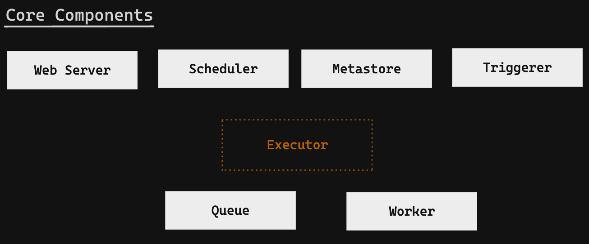

- Airflow is an orchestrator, not a processing framework. Process your gigabytes of data outside of Airflow (i.e. You have a Spark cluster, you use an operator to execute a Spark job, and the data is processed in Spark).
- A **DAG** is a data pipeline, an **Operator** is a task.
- An **Executor** defines how your tasks are executed, whereas a **worker** is a process executing your task
- The **Scheduler** schedules your tasks, the **web server** serves the UI, and the **database** stores the metadata of Airflow.

### One Node Architecture
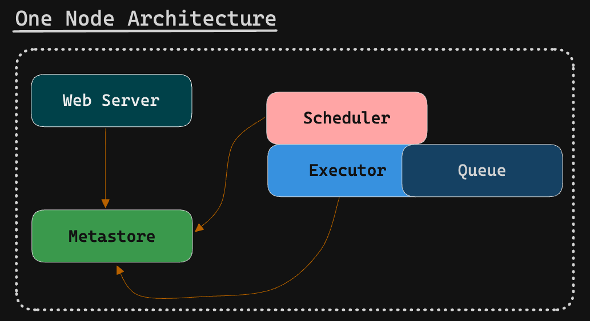

### Multi Node Architecture
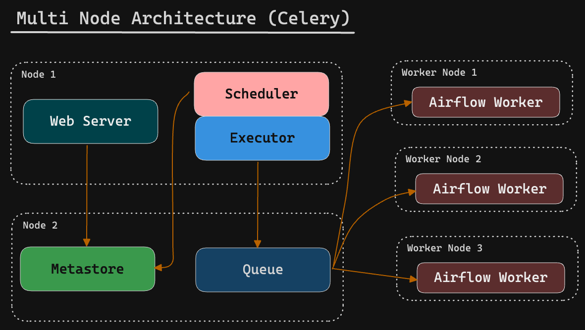

### How does it Work ?
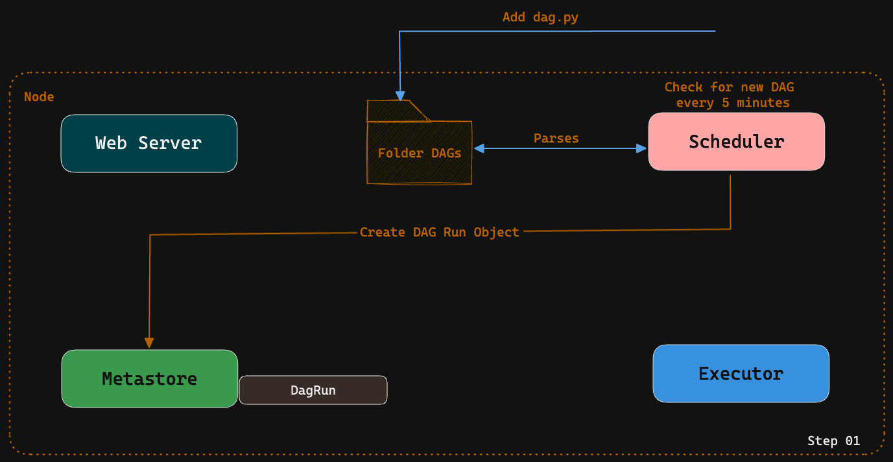
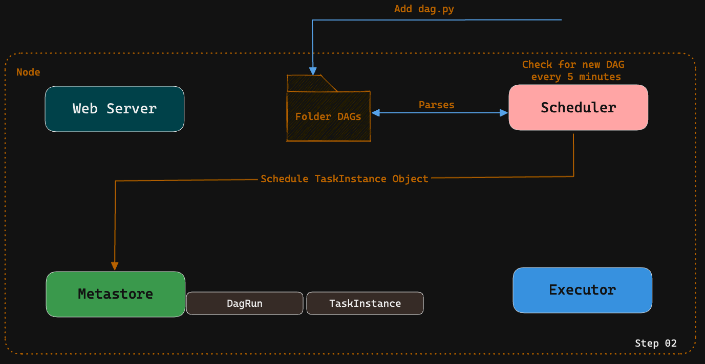
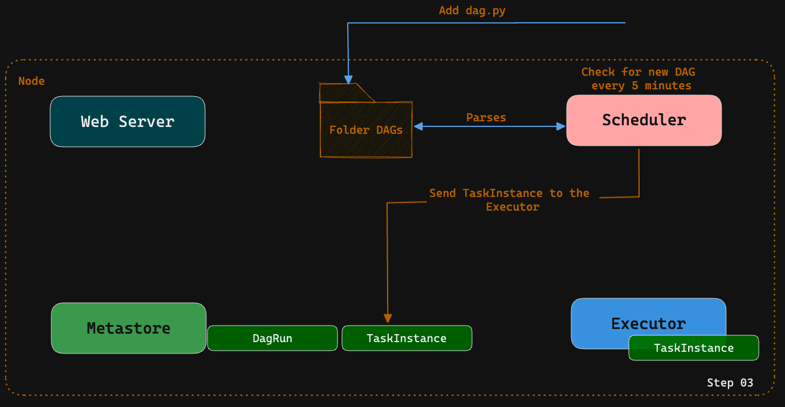
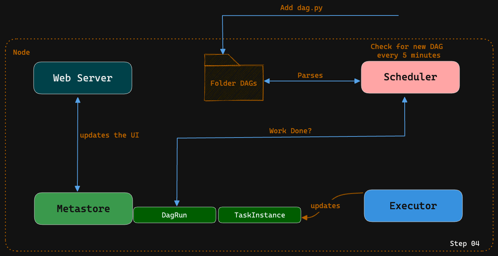

### DAG
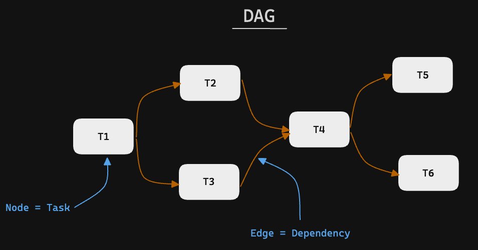

### Operator
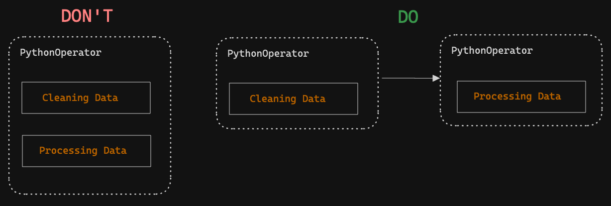

#### 3 Types of Operator
- **Action Operators**: _Execute_ an action (Python Operators & Bash Operators)
- **Action Operators**: _Transfer_ data
- **Action Operators**: _Wait_ for a Condition to be met

### Hooks
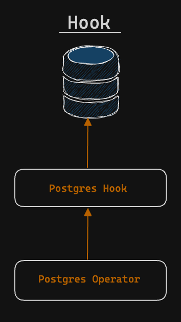   

In Apache Airflow, a hook is a way to interact with external systems or services within your workflows. It provides a high-level interface to connect and interact with various systems, such as databases, cloud services, message queues, and more. Hooks abstract the implementation details of interacting with these systems, providing a consistent and simplified interface.

### DAG Scheduling
- **start_date**: the timestamp from which the scheduler will attempt to backfill
- **scheduler_interval**: How often a DAG runs
- **end_date**: The timestamp from which a DAG ends

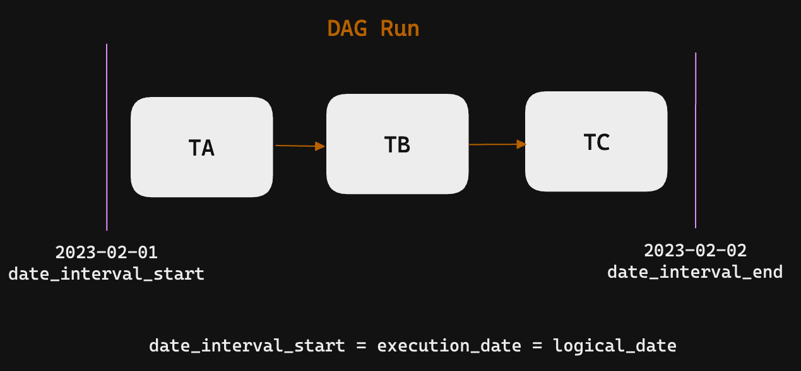

> A DAG is triggered **AFTER** the `start_date/last_run + the schedule_interval`

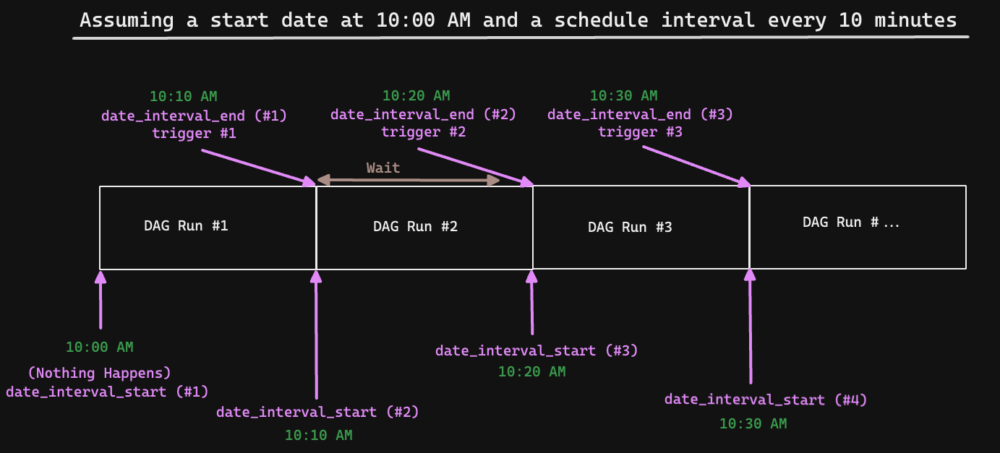
